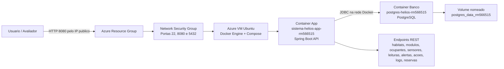

# Sistema Helios

Backend Java/Spring Boot para gerenciamento e monitoramento de habitats espaciais autonomos. O sistema registra habitats, modulos, ocupantes, sensores, leituras, alertas, acoes automaticas, logs e reservas operacionais.

## Equipe

- Arth.pv (ArthurCPV) - RM566515
- JuliaB (JuliaTButtler) - RM564975
- Mari (Marixavq) - RM566357
- Bruno Martins Bettio (TaikaWaititi) - RM564939
- Jose Diogo Da Silva Neves (ZeDio) - RM562341

> Nesta entrega DevOps, o RM usado nos nomes dos containers e recursos Docker e `RM566515`. Caso outro integrante seja o representante oficial, altere `rm566515` no `docker-compose.yml` antes da gravacao.

## Tecnologias

- Java 21
- Spring Boot
- Spring Data JPA
- PostgreSQL no Docker/Azure
- H2 como fallback local
- Maven
- Docker e Docker Compose
- Swagger/OpenAPI

## Arquitetura Macro em Nuvem



## Requisitos DevOps Atendidos

- Aplicacao Java conteinerizada com imagem personalizada via `Dockerfile`.
- Container da aplicacao executando com usuario nao privilegiado `helios`.
- Diretorio de trabalho definido em `/opt/sistema-helios`.
- Variaveis de ambiente configuradas para app e banco.
- Portas expostas: app `8080`, banco `5432`.
- Containers com nome contendo RM: `sistema-helios-app-rm566515` e `postgres-helios-rm566515`.
- Banco PostgreSQL com volume nomeado `postgres_data_rm566515`.
- App e banco na mesma rede Docker `helios-net-rm566515`.
- CRUDs disponiveis para as entidades principais.
- Persistencia em tabelas relacionadas, como `modulos_habitacionais -> habitats`, `sensor -> modulos_habitacionais`, `alerta -> sensor/modulo`, `acao_automatica -> alerta` e `reservas -> ocupantes/modulos_habitacionais`.

## Execucao na VM Azure

1. Conecte na VM:

```bash
ssh azureuser@IP_PUBLICO_DA_VM
```

2. Instale Docker na VM, caso ainda nao esteja instalado:

```bash
chmod +x scripts/azure-vm-setup.sh
./scripts/azure-vm-setup.sh
```

Depois do script, saia e entre novamente via SSH para atualizar o grupo do usuario.

3. Clone o repositorio:

```bash
git clone https://github.com/TaikaWaititi/global-codeinstars-devops.git
cd global-codeinstars-devops
```

4. Configure variaveis de ambiente:

```bash
cp .env.example .env
nano .env
```

Por padrao, a API publica fica em `8080` e o banco em `5432`. Se outra aplicacao estiver usando essas portas durante um teste local, altere `APP_HOST_PORT` ou `DB_HOST_PORT` no `.env`.

5. Suba os containers em segundo plano:

```bash
docker compose up -d --build
```

6. Confira os containers:

```bash
docker compose ps
```

7. Acesse a aplicacao usando o IP publico da VM:

- API: `http://IP_PUBLICO_DA_VM:8080`
- Swagger: `http://IP_PUBLICO_DA_VM:8080/swagger-ui.html`

As portas `8080` e `5432` precisam estar liberadas no Network Security Group da VM Azure. A porta `5432` deve ser restrita ao IP de quem vai avaliar/gravar quando possivel.

Para um passo a passo focado em Azure, consulte [AZURE_DEPLOY.md](AZURE_DEPLOY.md).

Tambem ha scripts prontos para a VM:

- `scripts/azure-vm-setup.sh`: instala Docker e Docker Compose.
- `scripts/azure-deploy.sh`: sobe app e banco com Docker Compose.
- `scripts/azure-smoke-test.sh`: cria dados via API para demonstracao.
- `scripts/azure-evidence.sh`: imprime logs, `exec` e `SELECTs` do banco.
- `azure-nsg-commands.md`: exemplos de regras de NSG pelo Azure CLI.

## Evidencias Obrigatorias para o Video

Mostre os logs dos dois containers:

```bash
docker logs sistema-helios-app-rm566515
docker logs postgres-helios-rm566515
```

Mostre diretorio e usuario do app:

```bash
docker container exec -it sistema-helios-app-rm566515 sh -lc "pwd && ls -la && whoami"
```

Resultado esperado:

- `pwd`: `/opt/sistema-helios`
- `whoami`: `helios`

Mostre diretorio e usuario do banco:

```bash
docker container exec -it postgres-helios-rm566515 sh -lc "pwd && ls -la && whoami"
```

## Teste de CRUD e Persistencia

Na VM Azure, defina:

```bash
export PUBLIC_IP=IP_PUBLICO_DA_VM
```

Crie os dados principais em sequencia:

Opcao rapida para a VM:

```bash
chmod +x scripts/*.sh
./scripts/azure-smoke-test.sh
```

Ou execute manualmente:

```bash
curl -X POST "http://${PUBLIC_IP}:8080/api/habitats" \
  -H "Content-Type: application/json" \
  -d '{"nome":"Tundralandia Alpha","localizacao":"Marte","tipoHabitat":"Residencial","capacidadeTotal":50,"statusOperacional":"Ativo"}'

curl -X POST "http://${PUBLIC_IP}:8080/api/ocupantes" \
  -H "Content-Type: application/json" \
  -d '{"nome":"Joao Silva","funcao":"Operador","statusOcupante":"ATIVO"}'

curl -X POST "http://${PUBLIC_IP}:8080/api/modulos" \
  -H "Content-Type: application/json" \
  -d '{"idHabitat":1,"nomeModulo":"Modulo Aurora","tipoModulo":"Residencial","capacidadeOcupantes":8,"capacidadeAtual":5,"statusModulo":"ATIVO","nivelRisco":"BAIXO","indiceRisco":"12%"}'

curl -X POST "http://${PUBLIC_IP}:8080/api/sensores" \
  -H "Content-Type: application/json" \
  -d '{"idModulo":1,"nomeSensor":"Sensor de Temperatura Sala 01","tipoSensor":"TEMPERATURA","statusSensor":"ATIVO","unidadeMedida":"C","limiteMinimo":18.0,"limiteMaximo":30.0,"intervaloLeituraSegundos":60}'

curl -X POST "http://${PUBLIC_IP}:8080/api/reservas" \
  -H "Content-Type: application/json" \
  -d '{"idOcupante":1,"idModulo":1,"dataInicio":"2026-05-31","dataFim":"2026-06-07","statusReserva":"Ativa"}'
```

Liste os registros pela API:

```bash
curl "http://${PUBLIC_IP}:8080/api/habitats"
curl "http://${PUBLIC_IP}:8080/api/ocupantes"
curl "http://${PUBLIC_IP}:8080/api/modulos"
curl "http://${PUBLIC_IP}:8080/api/sensores"
curl "http://${PUBLIC_IP}:8080/api/reservas"
```

Evidencie a persistencia diretamente no banco:

Opcao rapida para gravacao:

```bash
./scripts/azure-evidence.sh
```

Ou execute manualmente:

```bash
docker container exec -it postgres-helios-rm566515 psql -U helios_user -d helios_db -c "select id, nome, localizacao, status_operacional from habitats;"
docker container exec -it postgres-helios-rm566515 psql -U helios_user -d helios_db -c "select id_ocupante, nome, funcao, status_ocupante from ocupantes;"
docker container exec -it postgres-helios-rm566515 psql -U helios_user -d helios_db -c "select id, habitat_id, nome_modulo, nivel_risco, status_modulo from modulos_habitacionais;"
docker container exec -it postgres-helios-rm566515 psql -U helios_user -d helios_db -c "select id, id_modulo, nome_sensor, tipo_sensor, status_sensor from sensor;"
docker container exec -it postgres-helios-rm566515 psql -U helios_user -d helios_db -c "select r.id, o.nome, m.nome_modulo, r.status_reserva from reservas r join ocupantes o on o.id_ocupante = r.id_ocupante join modulos_habitacionais m on m.id = r.id_modulo;"
```

## Comandos Uteis

Parar os containers:

```bash
docker compose down
```

Parar e remover tambem o volume do banco:

```bash
docker compose down -v
```

Rodar testes Java:

```bash
./mvnw test
```

No Windows:

```powershell
.\mvnw.cmd test
```

## Entrega

A entrega da disciplina deve conter um PDF com:

- Pagina de rosto com nome da equipe, RM e nome completo dos integrantes.
- Link publico do GitHub com este projeto.
- Link do video demonstrativo no YouTube.

O video deve demonstrar a execucao em nuvem, iniciando pelo clone do repositorio, subindo os containers em background, exibindo logs, acessando os containers com `exec`, executando os CRUDs e comprovando a persistencia com `SELECT` conectado diretamente no container do banco.
